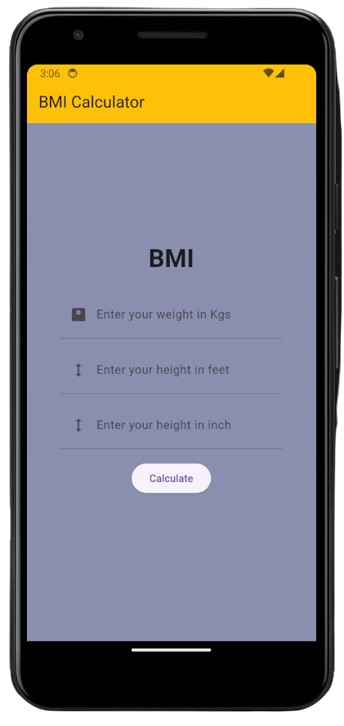

# BMI Calculator App

This BMI (Body Mass Index) Calculator app built with Flutter helps users calculate their BMI based on their height and weight inputs. It offers a simple interface for users to track and understand their BMI.

## Features

- **BMI Calculation:** Calculate BMI based on user-entered height and weight.
- **BMI Categories:** Display BMI categories (underweight, normal weight, overweight, obese) according to calculated BMI.
- **Metric & Imperial Units:** Support for both metric (kilograms, meters) and imperial (pounds, inches) units.

## Technologies Used

- **Flutter:** Framework for building cross-platform mobile applications.

## Installation

1. **Clone Repository:** `git clone https://github.com/your-username/bmi-calculator.git`
2. **Navigate to Project:** `cd bmi-calculator`
3. **Install Dependencies:** `flutter pub get`
4. **Run the App:** `flutter run`

## Usage

1. Launch the app on an emulator or a physical device.
2. Enter your height and weight using metric or imperial units.
3. View your calculated BMI and corresponding BMI category.
4. Use the app to track changes in BMI over time.

## Screenshots

## Contributing

Contributions are welcome! If you'd like to contribute to this project, please fork the repository and create a pull request with your changes.

## License

This project is licensed under the [MIT License](LICENSE).

## Acknowledgements

- **Flutter Community:** Acknowledge any Flutter packages or resources used during development.
